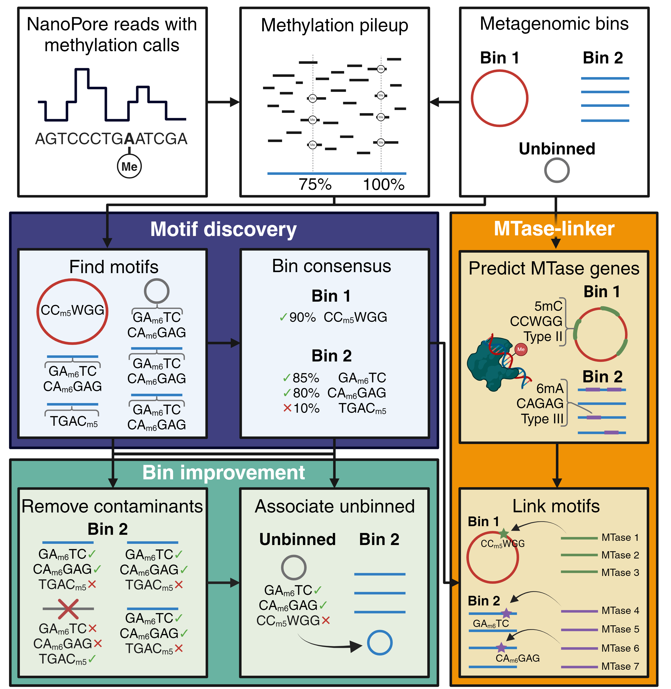

# Nanomotif
[](https://anaconda.org/bioconda/nanomotif)      [](https://badge.fury.io/py/nanomotif)

Nanomotif is a Python package designed to explore methylation in prokaryotic genomes using Nanopore sequencing. Nanomotif is a fast, scalable, and sensitive tool for identification and utilization of methylation motifs in monocultures and metagenomic samples.
  - [Overview](#nanomotif-offers)
  - [Documentation](#documentation)
  - [Installation](#installation)
  - [Usage](#usage)
  - [Citation](#citation)


### Nanomotif offers
- de novo methylated motif identification
- metagenomic bin contamination detection
- bin association of unbinned contigs (eg. plasmids)
- association of MTases and RM-systems to motifs.
<p align="center">
  
</p>


## Documentation
Please see the [documentation](https://nanomotif.readthedocs.io) for detailed installation and usage instructions, descriptions of required files, and analysis examples.


## Skip the Documentation: Your Quickstart Guide to Nanomotif

### Installation

Nanomotif can easily be installed using Conda for managing your Python environments. You can create a new environment and install Nanomotif as follows:
```shell
conda create -n nanomotif  python=3.12
conda activate nanomotif
conda install -c conda-forge -c bioconda nanomotif
```

#### Check installation
Once installed, the installation can be checked by running:
```shell
nanomotif check_installation
```
This runs a test run on a small dataset, ensuring everything works.

For further details, check out the [installation guidelines]().


### Usage
#### Required files

To identify methylated motifs, the following files are required: 
- Assembly (fasta file)
- [modkit](https://github.com/nanoporetech/modkit/blob/master/book/src/advanced_usage.md#pileup) methylation pileup
- tab-separated file describing `contig-bin` relationship.

For further details, check out the [required files](https://nanomotif.readthedocs.io/en/latest/required_files.html) documentation.


#### Motif discovery

Whether you are interested in finding methylated motifs in monoculture samples or metagenomic samples, we recomment just running `motif_discovery`

```
nanomotif motif_discovery ASSEMBLY.fasta PILEUP.bed CONTIG_BIN.tsv -t THREADS --out OUT
```

This will create three files: `motifs.tsv`,`motif-scored.tsv`, and `bin-motifs.tsv`. Highly methylated motifs are found in `bin-motifs.tsv`.

See [usage](https://nanomotif.readthedocs.io/en/latest/usage.html) and [output](https://nanomotif.readthedocs.io/en/latest/output.html) for detailed usage and output information.

#### Bin contamination
After motif identification it is possible to identify contamination in bins using the `bin-motifs.tsv`, `assembly`, `pileup` and `contig_bin` file.

```
nanomotif detect_contamination --pileup PILEUP --assembly ASSEMBLY --bin_motifs BIN_MOTIFS --contig_bins CONTIG_BIN --out OUT
```
This will generate a bin_contamination.tsv specifying the contigs, which is flagged as contamination.

If the --write_bins and the --assembly_file flags are specified new de-contaminated bins will be written to a bins folder.

See [usage](https://nanomotif.readthedocs.io/en/latest/usage.html) and [output](https://nanomotif.readthedocs.io/en/latest/output.html) for detailed usage and output information.

#### Include unbinned contigs
The `include_contigs` command assigns unbinned contigs in the assembly file to bins by training three classifiers, random forest, linear discriminant analysis, and k neighbors classifier, on the methylation pattern of the bins.

```
nanomotif include_contigs --pileup PILEUP --assembly ASSEMBLY --bin_motifs BIN_MOTIFS --contig_bins CONTIG_BIN --run_detect_contamination --out OUT
```
> Note: this is not a binner and included contigs should be considered putative. Methylation patterns can be shared across MAGs, which is problematic for unrecovered MAGs.

If decontamination should not be performed, the `include_contigs` can be run without the `--run_detect_contamination` flag or without the `--contamination_file` flag.

#### MTase-linker
This module tries to link methylation motifs to their corresponding MTase and, when present, their entire RM system. 

The MTase-Linker module has additional dependencies that are not automatically installed with Nanomotif. Therefore, before using this module, you must manually install these dependencies using the `MTase-linker install` command.
The `MTase-linker` module requires that conda is available on your system.

```
nanomotif MTase-linker install
```

This will create a folder named `ML_dependencies` in your current working directory, containing the required dependencies for the MTase-linker module. You can use the `--dependency_dir` flag to change the installation location of the `ML_dependencies` folder.

The installation requires conda to generate a few environments, and it takes a bit time as it runs the workflow on a small dataset to check the installation. 

When the additional dependencies are installed you can run the workflow using `MTase-linker run`

```
nanomotif MTase-linker run -t 10 --assembly ASSEMBLY.fasta --contig_bin contig_bin.tsv --bin_motifs nanomotif/bin_motifs.tsv -d ML_dependencies -o mtase_linker
```

Running the nanomotif MTase-linker run command will generate two primary output files: mtase_assignment_table.tsv and nanomotif_assignment_table.tsv. The first file lists all predicted MTase genes in the genome along with their predicted methylation characteristics and whether the module was able to unambiguously assign any detected motifs to the MTase (`linked` = (True/False)).
The second file includes data from the bin-motifs.tsv of the nanomotif output with two additional columns `linked` and `candidate_genes`. The `linked` variable is a boolean indicator if the motif could be unambiguously linked to a MTase in the bin/genome (TRUE/FALSE). If True the gene_id of the MTase is provided in `candidate_gene`. If False, the `candidate_gene` variable lists feasible candidate facilitators of the modification based on motif type and modification type predictions.

## Citation

Please cite our preprint if you use Nanomotif for your research:

Nanomotif: Leveraging DNA Methylation Motifs for Genome Recovery and Host Association of Plasmids in Metagenomes from Complex Microbial Communities.
Søren Heidelbach, Sebastian Mølvang Dall, Jeppe Støtt Bøjer, Jacob Nissen, Lucas Nicolaas Ludovic van der Maas, Mantas Sereika, Rasmus Kirkegaard, Sabrina Just Kousgaard, Ole Thorlacius-Ussing, Sheila I Jensen, Katja Hose, Thomas Dyhre Nielsen, Mads Albertsen. Preprint at *bioRxiv* https://doi.org/10.1101/2024.04.29.591623 (2024)

## License

Nanomotif is released under the [MIT License](https://github.com/your-username/nanomotif/blob/main/LICENSE). Feel free to use, modify, and distribute the package in accordance with the terms of the license.

## Acknowledgments

Nanomotif builds upon various open-source libraries and tools that are instrumental in its functionality. We would like to express our gratitude to the developers and contributors of these projects for their valuable work.


