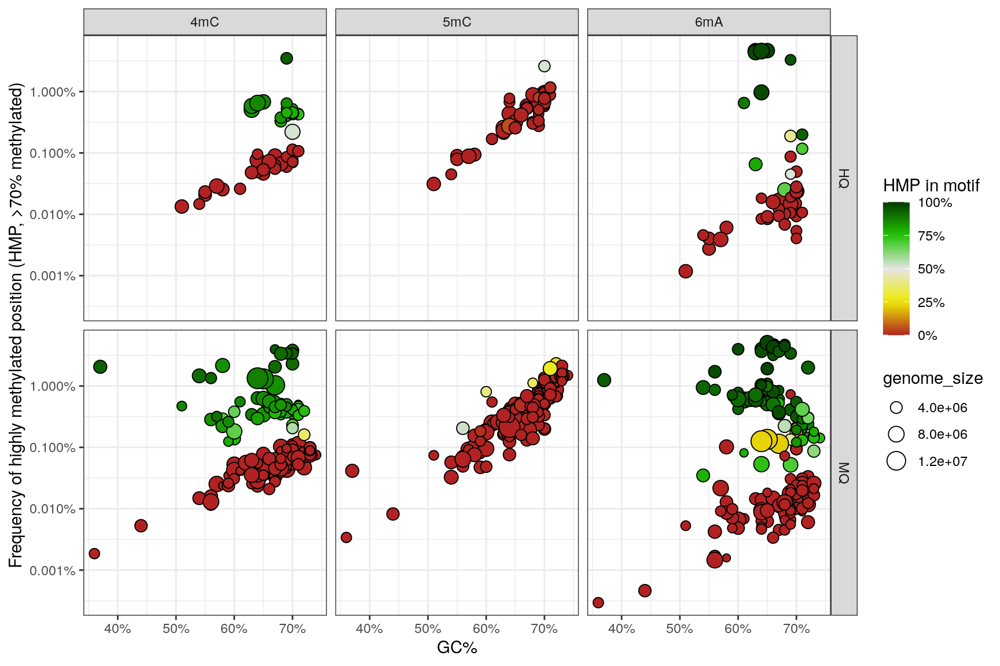

# Known issues

Here we list some known issues with Nanomotif and Nanopore methylation calling in general, which can lead to identification of false positive motifs.

## False positives around motif of other methylation types

Motifs are sometimes detected around motifs of a different methylation type, for example 5mC motifs detected around 6mA motifs. This is not actual methylation motifs, but systematic false positives in Nanopore methylation calling. An example is the identification of CCWGG derived 6mA motifs around CCWGG 5mC motifs in E. coli.

## High systematic 5mC noise in high GC% regions

We have observed that in some genomes with high GC% (e.g. *Meiothermus ruber*), there is a high systematic noise in methylation calling, leading to false positive motifs. These motifs are generally removed, but in some cases, they can be difficult to distinguish from true motifs based on the context. We recommend manually checking for these motifs in high GC% genomes.

*Figure 1. High systematic 5mC noise in high GC% MAGs in a soil sample. Each dot represent a MAG, on the y-axis is the frequency of highly methylated positions (>70% methylated) and on x-axis is the GC% of the MAG. The color indicated how much methylation is captured in an identified motif. There is a clear trend of increasing methylation noise with increasing GC% in MAGs with no motif identified. In high GC% MAGs, the noise can be as high as 1% of positions being called as methylated, as high as some generic motifs*